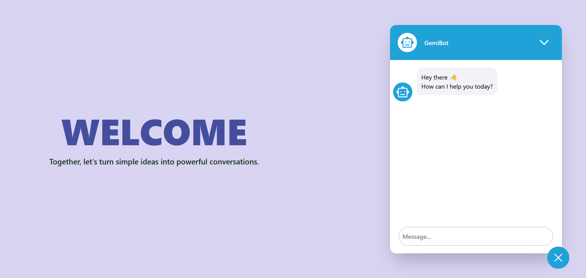

# GemiBot


This is a chatbot made with React Js and Gemini API; combining both beautiful style and intuitive usage.

## Table of Contents
- [Introduction](#introduction)
- [Features](#features)
- [Installation](#installation)
- [Contributing](#contributing)

## Introduction

Welcome to **GemiBot**, your AI-powered assistant!  
Whether you're looking for answers, casual conversation, or help with a task, GemiBot is ready to chat — anytime, anywhere.  
It's built with simplicity, scalability, and usability in mind.


## Features

- **Real-time AI conversations** via Gemini API
- **Sleek and modern UI** using React.js
- **Responsive design** works great on desktop and mobile


## Installation
Getting started is simple. Just clone the project:

```bash
git clone https://github.com/mathoxy/gemibot.git
cd gemibot
```

If you're running the chatbot locally, create a .env file in the root folder and add your Gemini API key:<br>
VITE_API_URL=your_api_url_here

## Contributing

Contributions are welcome.

You can contribute in the following ways:  
- **Feedback:** Share suggestions to improve the chat experience  
- **Bug Fixes:** Report any issues or unexpected behaviors  
- **Enhancements:** Submit pull requests with new features or improvements
- **Others...**

To contribute:

1. Fork the repository  
2. Create a new branch  
   `git checkout -b feature/your-feature`  
3. Commit your changes  
   `git commit -m "Add new feature"`  
4. Push the branch  
   `git push origin feature/your-feature`  
5. Open a pull request on GitHub

All contributions that improve GemiBot are appreciated.
